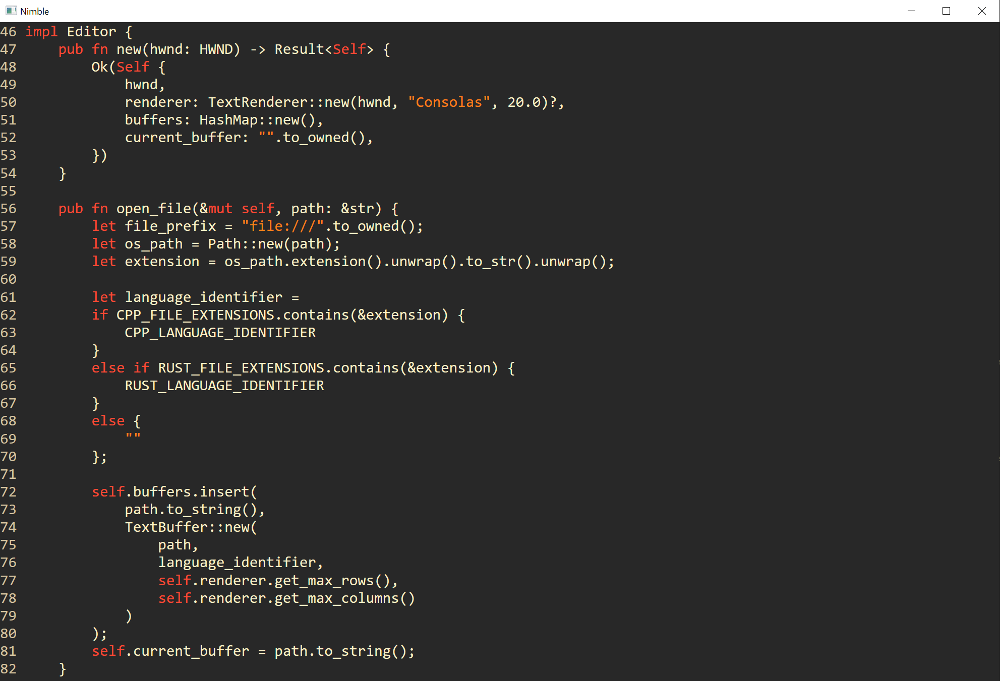

# Nimble
Nimble - A minimalist text editor in Rust

# Goals
- Easy code navigation
- Code completion
- Simple syntax highlighting

# Current Feature Set
- Basic text editor functionality
- DirectWrite font rendering
