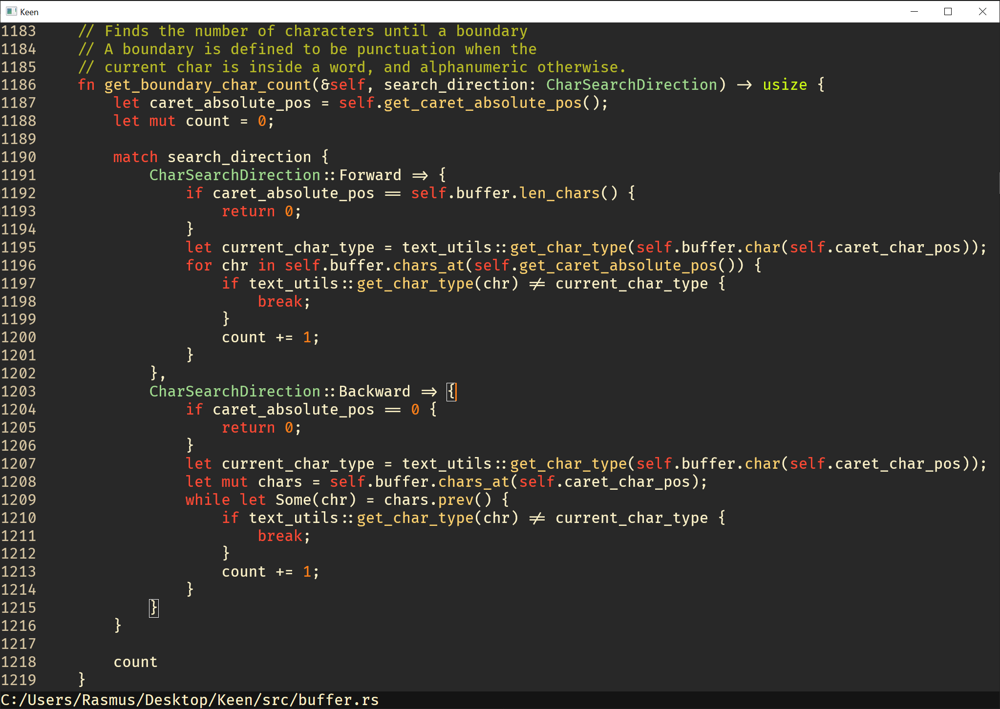

# Keen
Keen - A minimalist text editor in Rust

# Goals
- A fast minimal text editor with
  - Easy code navigation
  - Syntax highlighting
  - Code completion
  - Code diagnostics
  - File tree

# Current Feature-Set
- Basic text editor functionality, excluding search and multiple cursors
- Semantic syntax highlighting for C++ and Rust (using the [Language Server Protocol](https://microsoft.github.io/language-server-protocol/))
- DirectWrite font rendering with arbitrary scalability and font ligatures.

## Current state

